# Execution Plan - 情報同期バッチ処理（2方式）

## Detailed Analysis Summary

### Change Impact Assessment
- **User-facing changes**: No — バッチ処理のバックエンド変更のみ
- **Structural changes**: Yes — Agent SDK版の新規Pythonモジュール追加、cron統合の再設計
- **Data model changes**: No — `_sync-state.json` スキーマは既存と同一
- **API changes**: No — 外部API利用は既存MCPサーバー経由で変更なし
- **NFR impact**: Yes — コスト制御、MCP接続の信頼性、エラーハンドリング

### Risk Assessment
- **Risk Level**: Medium
- **Rollback Complexity**: Easy（新規追加のため、既存スクリプトに影響なし）
- **Testing Complexity**: Moderate（MCPサーバー接続のテストが必要）

---

## Workflow Visualization

```mermaid
flowchart TD
    Start(["User Request"])

    subgraph INCEPTION["INCEPTION PHASE"]
        WD["Workspace Detection<br/><b>COMPLETED</b>"]
        RA["Requirements Analysis<br/><b>COMPLETED</b>"]
        WP["Workflow Planning<br/><b>IN PROGRESS</b>"]
        AD["Application Design<br/><b>EXECUTE</b>"]
        UG["Units Generation<br/><b>EXECUTE</b>"]
    end

    subgraph CONSTRUCTION["CONSTRUCTION PHASE"]
        direction TB
        subgraph Unit1["Unit 1: Agent SDK Core"]
            FD1["Functional Design<br/><b>EXECUTE</b>"]
            NFR1["NFR Requirements<br/><b>EXECUTE</b>"]
            CG1["Code Generation<br/><b>EXECUTE</b>"]
        end
        subgraph Unit2["Unit 2: Orchestration"]
            CG2["Code Generation<br/><b>EXECUTE</b>"]
        end
        BT["Build and Test<br/><b>EXECUTE</b>"]
    end

    Start --> WD
    WD --> RA
    RA --> WP
    WP --> AD
    AD --> UG
    UG --> FD1
    FD1 --> NFR1
    NFR1 --> CG1
    CG1 --> CG2
    CG2 --> BT
    BT --> End(["Complete"])

    style WD fill:#4CAF50,stroke:#1B5E20,stroke-width:3px,color:#fff
    style RA fill:#4CAF50,stroke:#1B5E20,stroke-width:3px,color:#fff
    style WP fill:#4CAF50,stroke:#1B5E20,stroke-width:3px,color:#fff
    style AD fill:#FFA726,stroke:#E65100,stroke-width:3px,stroke-dasharray: 5 5,color:#000
    style UG fill:#FFA726,stroke:#E65100,stroke-width:3px,stroke-dasharray: 5 5,color:#000
    style FD1 fill:#FFA726,stroke:#E65100,stroke-width:3px,stroke-dasharray: 5 5,color:#000
    style NFR1 fill:#FFA726,stroke:#E65100,stroke-width:3px,stroke-dasharray: 5 5,color:#000
    style CG1 fill:#4CAF50,stroke:#1B5E20,stroke-width:3px,color:#fff
    style CG2 fill:#4CAF50,stroke:#1B5E20,stroke-width:3px,color:#fff
    style BT fill:#4CAF50,stroke:#1B5E20,stroke-width:3px,color:#fff
    style Start fill:#CE93D8,stroke:#6A1B9A,stroke-width:3px,color:#000
    style End fill:#CE93D8,stroke:#6A1B9A,stroke-width:3px,color:#000
    style INCEPTION fill:#BBDEFB,stroke:#1565C0,stroke-width:3px,color:#000
    style CONSTRUCTION fill:#C8E6C9,stroke:#2E7D32,stroke-width:3px,color:#000
    style Unit1 fill:#E8F5E9,stroke:#43A047,stroke-width:2px,color:#000
    style Unit2 fill:#E8F5E9,stroke:#43A047,stroke-width:2px,color:#000

    linkStyle default stroke:#333,stroke-width:2px
```



### Text Alternative

```
Phase 1: INCEPTION
  - Workspace Detection (COMPLETED)
  - Requirements Analysis (COMPLETED)
  - Workflow Planning (IN PROGRESS)
  - Application Design (EXECUTE)
  - Units Generation (EXECUTE)

Phase 2: CONSTRUCTION
  Unit 1: Agent SDK Core
    - Functional Design (EXECUTE)
    - NFR Requirements (EXECUTE)
    - Code Generation (EXECUTE)
  Unit 2: Orchestration & Cron Integration
    - Code Generation (EXECUTE)
  - Build and Test (EXECUTE)

Phase 3: OPERATIONS
  - Operations (PLACEHOLDER)
```

---

## Phases to Execute

### INCEPTION PHASE
- [x] Workspace Detection (COMPLETED)
- [SKIP] Reverse Engineering — Greenfield project
- [x] Requirements Analysis (COMPLETED)
- [SKIP] User Stories — インフラ系プロジェクト、ユーザー対面機能なし
- [x] Workflow Planning (IN PROGRESS)
- [ ] Application Design - **EXECUTE**
  - **Rationale**: Agent SDK版の新規アーキテクチャ設計が必要。MCPサーバー接続パターン、Pythonモジュール構成、claude -p版との共通ロジック設計
- [ ] Units Generation - **EXECUTE**
  - **Rationale**: 2つの論理ユニット（Agent SDK Core + Orchestration）への分割が必要

### CONSTRUCTION PHASE

#### Unit 1: Agent SDK Core（MCP接続 + 4同期タスク実装）
- [ ] Functional Design - **EXECUTE**
  - **Rationale**: MCPサーバー接続アダプター、エージェントループ、各同期タスクのビジネスロジック設計
- [ ] NFR Requirements - **EXECUTE**
  - **Rationale**: APIコスト制御（トークン数制限）、MCP接続の信頼性、ハルシネーション対策、エラーリトライ
- [SKIP] NFR Design — NFR要件はコード生成で直接実装可能
- [SKIP] Infrastructure Design — ローカルmacOS実行、クラウドインフラ不要
- [ ] Code Generation - **EXECUTE**
  - **Rationale**: Python Agent SDKコード、MCPアダプター、4同期タスク実装

#### Unit 2: Orchestration & Cron Integration
- [SKIP] Functional Design — Unit 1の設計で網羅
- [SKIP] NFR Requirements — Unit 1と共通
- [ ] Code Generation - **EXECUTE**
  - **Rationale**: cron統合スクリプト、sync-all-cron.sh更新、方式切替機構

#### 共通
- [ ] Build and Test - **EXECUTE**
  - **Rationale**: Agent SDK版のユニットテスト、MCPサーバー接続テスト、統合テスト

---

## Success Criteria

- **Primary Goal**: Agent SDK（Python）版の4同期タスクが既存claude -p版と同等に動作すること
- **Key Deliverables**:
  1. Agent SDK版Pythonコード（MCPサーバー接続 + 4同期タスク）
  2. cron統合スクリプト（claude -p / Agent SDK切替可能）
  3. 設計文書一式
  4. テストコード
- **Quality Gates**:
  - 各同期タスクが既存と同一フォーマットのファイルを出力すること
  - `_sync-state.json` の整合性が保たれること
  - APIコストが既存水準を大きく超えないこと
