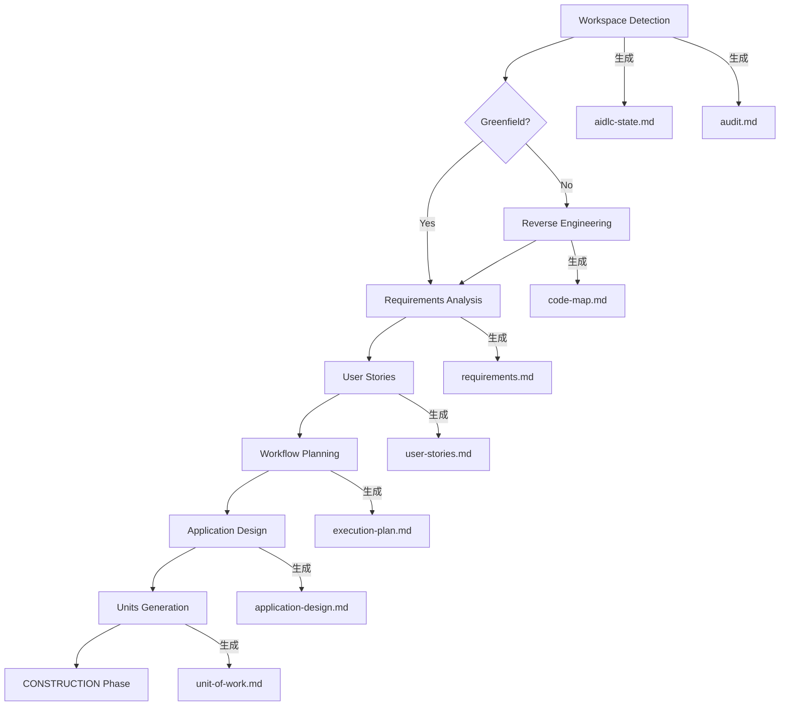

# Domain Entities - Unit 3: Part III（Inceptionフェーズ・計画編）

## 概要

Part III で登場する主要概念・用語と相互関係を定義する。書籍の用語統一と、各章での説明の整合性を保つために使用する。

---

## 1. AI-DLC フレームワーク概念

### 1.1 フェーズ・ステージ

| 用語 | 定義 | 初登場章 |
|------|------|---------|
| **INCEPTIONフェーズ** | AI-DLCの第1フェーズ。プロジェクトの起点から実行計画の確定までを担う | Ch.7 冒頭 |
| **CONSTRUCTIONフェーズ** | AI-DLCの第2フェーズ。設計・コード生成・テストを担う | Ch.11.5 |
| **OPERATIONSフェーズ** | AI-DLCの第3フェーズ。運用・保守を担う | Ch.11.5（言及のみ） |
| **Workspace Detection** | INCEPTIONの第1ステージ。プロジェクトの状態（GF/BF）を検出する | Ch.7 |
| **Reverse Engineering** | INCEPTIONの第2ステージ。Brownfieldプロジェクトの既存コードを分析する | Ch.8 |
| **Requirements Analysis** | INCEPTIONの第3ステージ。プロジェクト要件を質問形式で収集・定義する | Ch.9 |
| **User Stories** | INCEPTIONの第4ステージ。要件をストーリー形式に変換する | Ch.10 |
| **Workflow Planning** | INCEPTIONの第5ステージ。実行するステージの計画を設計する | Ch.10 |
| **Application Design** | INCEPTIONの第6ステージ。高レベルコンポーネント設計を行う | Ch.11 |
| **Units Generation** | INCEPTIONの第7ステージ。システムをユニットに分解する | Ch.11 |

### 1.2 プロジェクト種別

| 用語 | 定義 | 初登場章 |
|------|------|---------|
| **Greenfield** | 新規開発プロジェクト。既存コードベースが存在しない | Ch.7 |
| **Brownfield** | 既存開発プロジェクト。既存コードベースが存在する | Ch.7 |

### 1.3 成果物ファイル

| ファイル名 | 役割 | 生成ステージ | 初登場章 |
|-----------|------|------------|---------|
| **aidlc-state.md** | AI-DLCの現在の状態・進捗を追跡するトラッキングファイル | Workspace Detection | Ch.7 |
| **audit.md** | AIとユーザーのやり取りを時系列で記録するログファイル | Workspace Detection | Ch.7 |
| **CLAUDE.md** | プロジェクト規約・AIへの指示を記述するファイル | 事前準備（ユーザーが作成） | Ch.7 |
| **code-map.md** | REで生成されるコードの地図（ファイル構成・役割のマッピング） | Reverse Engineering | Ch.8 |
| **dependency-analysis.md** | REで生成される依存関係分析レポート | Reverse Engineering | Ch.8 |
| **architecture-overview.md** | REで生成されるアーキテクチャ概要図 | Reverse Engineering | Ch.8 |
| **requirements.md** | 要件定義書 | Requirements Analysis | Ch.9 |
| **user-stories.md** | ユーザーストーリー一覧 | User Stories | Ch.10 |
| **execution-plan.md** | 実行するステージの計画書 | Workflow Planning | Ch.10 |
| **application-design.md** | 高レベルコンポーネント設計書 | Application Design | Ch.11 |
| **unit-of-work.md** | ユニット定義・責務リスト | Units Generation | Ch.11 |
| **unit-of-work-dependency.md** | ユニット間の依存関係マトリクス | Units Generation | Ch.11 |
| **unit-of-work-story-map.md** | ストーリー→ユニット→機能のマッピング | Units Generation | Ch.11 |

### 1.4 主要概念

| 用語 | 定義 | 初登場章 |
|------|------|---------|
| **適応型深度** | プロジェクトの規模・複雑度・コンテキストに応じて、分析・設計の深さを自動調整する概念 | Ch.9 |
| **[Answer]:タグ** | 質問ファイル内でユーザーの回答を記入する箇所を示すタグ | Ch.9 |
| **per-unit loop** | ConstructionフェーズでユニットごとにFunctional Design → Code Generationを繰り返すプロセス | Ch.10 |
| **ユニット** | 開発作業の論理的なグループ。マイクロサービスの場合は独立デプロイ可能なサービス、モノリスの場合は論理モジュール | Ch.11 |

---

## 2. ECサイト（サンプルプロジェクト）のドメイン概念

### 2.1 サンプルプロジェクト概要

- **プロジェクト名**: BookCart（書籍・雑貨を販売するB2C物販サイト）
- **テックスタック**: TypeScript + Next.js（App Router）
- **規模感**: 中小企業、商品数1,000点程度、月間注文数1,000件程度

### 2.2 ドメインエンティティ

| エンティティ | 説明 | 主要属性 |
|------------|------|---------|
| **Product（商品）** | 販売する商品 | id, name, price, stock, category, imageUrl |
| **Category（カテゴリ）** | 商品分類 | id, name, parentCategoryId |
| **Customer（顧客）** | 購買者 | id, email, name, address |
| **Cart（カート）** | 購入前の一時的な商品リスト | id, customerId, items[] |
| **CartItem（カートアイテム）** | カート内の1商品 | productId, quantity, price |
| **Order（注文）** | 購入確定した取引 | id, customerId, items[], totalAmount, status |
| **OrderItem（注文明細）** | 注文内の1商品 | productId, quantity, unitPrice |
| **Payment（支払い）** | 決済情報 | id, orderId, method, amount, status |
| **Address（住所）** | 配送先住所 | postalCode, prefecture, city, line1, line2 |

### 2.3 主要ビジネスプロセス（Inceptionフェーズで要件定義する対象）

| プロセス | 説明 | 関連エンティティ |
|---------|------|--------------|
| 商品閲覧 | 顧客が商品を検索・一覧表示・詳細確認する | Product, Category |
| カート操作 | 商品をカートに追加・変更・削除する | Cart, CartItem, Product |
| 注文確定 | カートから注文を作成し、決済を完了する | Order, OrderItem, Payment |
| 注文管理 | 顧客が自分の注文履歴を確認する | Order, OrderItem |
| 在庫管理 | 注文確定時に在庫を減らす | Product（stock） |

---

## 3. Brownfieldサブシナリオ（Chapter 8）のドメイン概念

### 3.1 サブシナリオ概要

- **プロジェクト名**: LegacyShop（3年前にリリースした既存ECサイト）
- **テックスタック**: Node.js（Express）+ MySQL（レガシー構成）
- **引き継ぎ理由**: 前任担当者の退職、ドキュメント不足、テスト不足
- **追加要件**: ポイントシステムの導入

### 3.2 追加するドメインエンティティ（ポイントシステム）

| エンティティ | 説明 | 主要属性 |
|------------|------|---------|
| **PointBalance（ポイント残高）** | 顧客のポイント残高 | customerId, balance, updatedAt |
| **PointTransaction（ポイント履歴）** | ポイントの増減履歴 | id, customerId, amount, type, orderId, createdAt |

---

## 4. ツール・環境のエンティティ

| 用語 | 定義 | 初登場章 |
|------|------|---------|
| **Claude Code** | AnthropicのCLIツール。AI-DLCワークフローのAIエンジンとして機能する | Ch.7 |
| **.steering/** | AI-DLCのルールファイルを格納するディレクトリ | Ch.7 |
| **aws-aidlc-rule-details/** | AI-DLCのベースレイヤールールファイル群 | Ch.7 |
| **MCP（Model Context Protocol）** | Claude Codeがツール・外部サービスと連携するためのプロトコル | Ch.7（言及のみ、詳細はPart II） |

---

## 5. 概念間の関係図

