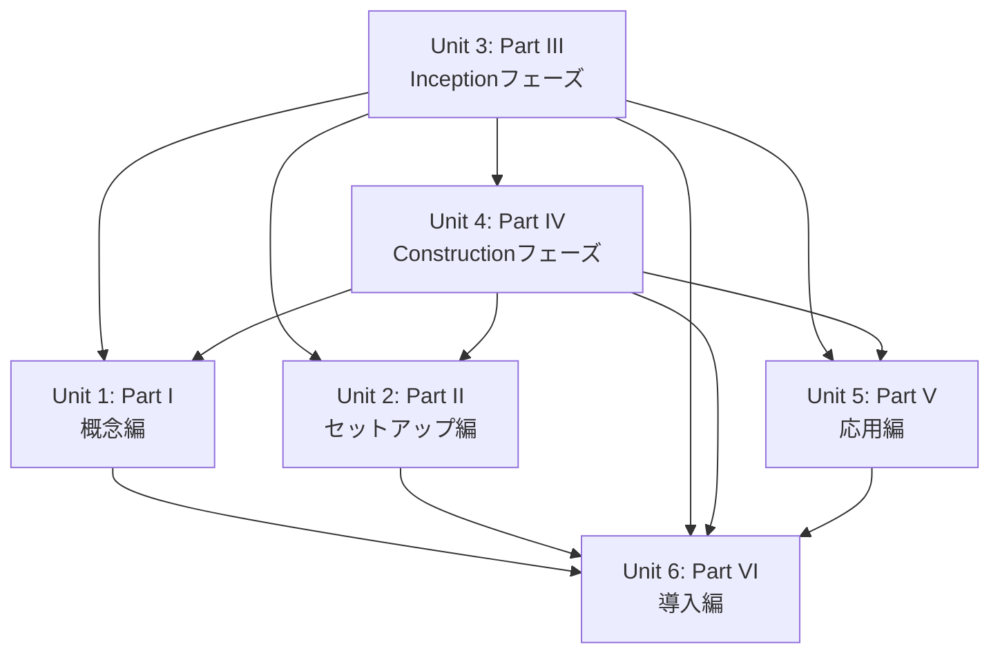

# Unit of Work Dependency - 実践AI-DLC入門

## 依存関係の定義

「執筆依存」= 「Xを書くためにはYが先に執筆されている必要がある」という関係。

---

## 執筆依存関係マトリクス

| ユニット | 依存するユニット | 理由 |
|---------|--------------|------|
| Unit 1（Part I） | Unit 3, 4 | 概念解説はコア実践（III・IV）執筆後に整合させる |
| Unit 2（Part II） | Unit 3, 4 | セットアップ手順は実際に使った環境・バージョンを正確に記述するため |
| Unit 3（Part III） | なし | コア部分として最初に執筆（独立） |
| Unit 4（Part IV） | Unit 3 | ConstructionはInceptionの成果物を引き継ぐ |
| Unit 5（Part V） | Unit 3, 4 | 拡張方法の解説はコア実践を理解した上で書く |
| Unit 6（Part VI） | Unit 1, 2, 3, 4, 5 | 事例は全パート完成後に整合させる |

---

## 依存関係図



---

## 推奨執筆順序（Q1: B - コア部分を先に）

```
1st: Unit 3（Part III）  ← コア、最初に執筆（依存なし）
2nd: Unit 4（Part IV）   ← Unit 3完成後
3rd: Unit 1（Part I）    ← Unit 3・4完成後（概念を整合させる）
4th: Unit 2（Part II）   ← Unit 3・4完成後（環境を正確に記述）
5th: Unit 5（Part V）    ← Unit 3・4完成後（拡張方法）
6th: Unit 6（Part VI）   ← 全ユニット完成後（事例を整合させる）
```

---

## 並行執筆可能なユニット

| タイミング | 並行可能な組み合わせ | 備考 |
|-----------|-------------------|------|
| Unit 3 執筆中 | なし | 単独作業 |
| Unit 3 完成後（Unit 4 執筆中） | なし | Unit 4 を優先 |
| Unit 3・4 完成後 | Unit 1 + Unit 2 + Unit 5 | 3ユニット間に相互依存なし |
| Unit 1〜5 完成後 | Unit 6（+ 付録） | 最終統合 |

---

## 読者視点の前提知識依存（書籍を読む順序）

書籍の「読む順序」は執筆順序と異なる。読者は Part I から順に読むことを想定する。

| パート | 前提として読んでほしいパート |
|--------|--------------------------|
| Part I | なし（導入部分） |
| Part II | Part I |
| Part III | Part I, II |
| Part IV | Part I, II, III |
| Part V | Part I, II, III, IV |
| Part VI | Part I〜V（ III・IV だけでも読める設計にする） |
