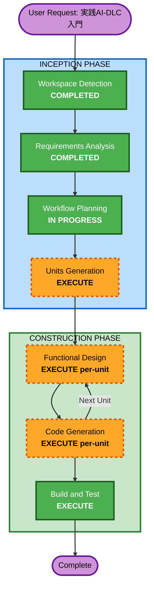

# Execution Plan - 実践AI-DLC入門

## Detailed Analysis Summary

### Change Impact Assessment
- **User-facing changes**: Yes - 新規書籍（読者向けコンテンツ全体を新規作成）
- **Structural changes**: Yes - 6パート23章+付録の大規模コンテンツ構造
- **Data model changes**: N/A（書籍プロジェクト）
- **API changes**: N/A（書籍プロジェクト）
- **NFR impact**: Yes - 商業出版レベルの品質基準、再現性、技術的正確性

### Risk Assessment
- **Risk Level**: Medium
  - コンテンツの正確性（AI-DLC公式解説としての信頼性）
  - 300ページ以上の大規模執筆（スケジュール管理）
  - 匿名化事例の適切な取り扱い
- **Rollback Complexity**: Easy（コンテンツの書き直しは可能）
- **Testing Complexity**: Moderate（技術的正確性のレビュー、チュートリアルの再現性確認）

---

## Workflow Visualization



### Text Alternative
```
Phase 1: INCEPTION
  - Stage 1: Workspace Detection (COMPLETED)
  - Stage 2: Requirements Analysis (COMPLETED)
  - Stage 3: Workflow Planning (IN PROGRESS)
  - Stage 4: Units Generation (EXECUTE)

Phase 2: CONSTRUCTION (per-unit loop)
  - Stage 5: Functional Design (EXECUTE per-unit) = 詳細目次・コンテンツ設計
  - Stage 6: Code Generation (EXECUTE per-unit) = 章コンテンツの執筆
  - Stage 7: Build and Test (EXECUTE) = コンテンツレビュー・品質確認
```

---

## Phases to Execute

### INCEPTION PHASE
- [x] Workspace Detection (COMPLETED)
- [x] Requirements Analysis (COMPLETED)
- [ ] Reverse Engineering - SKIP
  - **Rationale**: Greenfieldプロジェクト（既存コードベースなし）
- [ ] User Stories - SKIP
  - **Rationale**: 読者ペルソナは要件定義で定義済み。書籍プロジェクトではUser Storiesの追加価値は低い
- [x] Workflow Planning (IN PROGRESS)
- [ ] Application Design - SKIP
  - **Rationale**: ソフトウェア設計は不要。書籍構成は要件定義で6パート23章として定義済み
- [ ] Units Generation - EXECUTE
  - **Rationale**: 300ページ以上・6パートの大規模書籍。パート単位でユニットに分割し、段階的に執筆を進める必要がある

### CONSTRUCTION PHASE (per-unit loop)
- [ ] Functional Design - EXECUTE (per-unit)
  - **Rationale**: 各パートの詳細目次・章ごとのコンテンツ設計・既存アセットとのマッピングが必要
- [ ] NFR Requirements - SKIP
  - **Rationale**: ソフトウェアの非機能要件は不要。品質基準は要件定義で定義済み
- [ ] NFR Design - SKIP
  - **Rationale**: NFR Requirements をスキップするため
- [ ] Infrastructure Design - SKIP
  - **Rationale**: インフラ設計は不要（書籍プロジェクト）
- [ ] Code Generation - EXECUTE (per-unit)
  - **Rationale**: 各パートの章コンテンツを生成。書籍におけるCode Generation = コンテンツ執筆
- [ ] Build and Test - EXECUTE
  - **Rationale**: 全パート完了後のコンテンツレビュー。技術的正確性、チュートリアル再現性、一貫性の確認

### OPERATIONS PHASE
- [ ] Operations - PLACEHOLDER
  - **Rationale**: 出版社への原稿提出・校正プロセスは将来対応

---

## Unit Decomposition Preview

書籍を6ユニットに分割予定（Units Generationで詳細化）:

| Unit | パート | 章 | 概要 |
|------|--------|-----|------|
| Unit 1 | Part I: AI-DLCの世界へ | Ch.1-3 | 概念・哲学・比較 |
| Unit 2 | Part II: 環境構築 | Ch.4-6 | セットアップ・MCPサーバー・ワークスペース設計 |
| Unit 3 | Part III: Inception | Ch.7-11 | Inceptionフェーズ全ステージの実践 |
| Unit 4 | Part IV: Construction | Ch.12-16 | Constructionフェーズ全ステージの実践 |
| Unit 5 | Part V: カスタマイズ | Ch.17-19 | 拡張レイヤー・独自ルール構築 |
| Unit 6 | Part VI: 実践事例 | Ch.20-23 + 付録 | E2Eウォークスルー・組織導入・FAQ |

---

## Estimated Timeline

- **Total Executing Stages**: 5（Units Generation + per-unit FD/CG x 6 + Build and Test）
- **Estimated Duration**: 3〜6ヶ月
- **Per-Unit Target**: 各ユニット 2〜4週間

## Success Criteria

- **Primary Goal**: シニアエンジニアが自社にAI-DLCを導入できる実践的な商業出版書籍の完成
- **Key Deliverables**:
  - 300ページ以上の書籍原稿（6パート23章+付録）
  - 各章のチュートリアルが再現可能であること
  - 既存アセット（ブログ・ルールファイル・事例）を効果的に活用
- **Quality Gates**:
  - 技術的正確性レビュー（AI-DLCフレームワークとの整合性）
  - チュートリアル再現性テスト
  - 全体構成の一貫性レビュー
