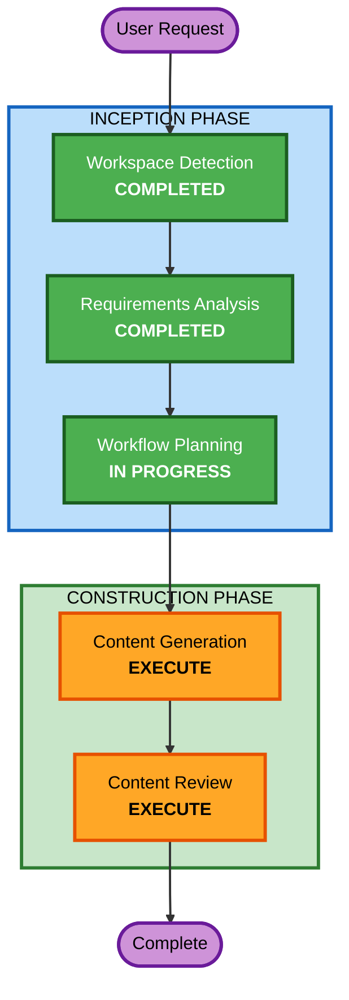

# Execution Plan: Harness Engineering 書籍

## Detailed Analysis Summary

### Project Type
- **分類**: Greenfield - 書籍制作プロジェクト（企画・設計フェーズ）
- **性質**: コンテンツ生成プロジェクト（ソフトウェア開発ではない）
- **AI-DLC適応**: CONSTRUCTIONフェーズの「Code Generation」を「Content Generation」として適応

### Change Impact Assessment
- **User-facing changes**: N/A（書籍プロジェクト）
- **Structural changes**: N/A
- **Data model changes**: N/A
- **API changes**: N/A
- **NFR impact**: N/A

### Risk Assessment
- **Risk Level**: Low（企画・設計段階であり、成果物はMarkdownドキュメント）
- **Rollback Complexity**: Easy（バージョン管理されたドキュメント）
- **Testing Complexity**: Simple（内容レビューによる検証）

---

## Workflow Visualization



### Text Alternative
```
Phase 1: INCEPTION
  - Stage 1: Workspace Detection (COMPLETED)
  - Stage 2: Requirements Analysis (COMPLETED)
  - Stage 3: Workflow Planning (IN PROGRESS)
  - Stage 4: Reverse Engineering (SKIP - Greenfield)
  - Stage 5: User Stories (SKIP - Book project)
  - Stage 6: Application Design (SKIP - No software components)
  - Stage 7: Units Generation (SKIP - Deliverables are straightforward)

Phase 2: CONSTRUCTION
  - Stage 8: Content Generation (EXECUTE - Create 3 deliverables)
  - Stage 9: Content Review & Validation (EXECUTE - Quality check)
  - Stage 10: Functional Design (SKIP - No software logic)
  - Stage 11: NFR Requirements (SKIP - No software NFR)
  - Stage 12: NFR Design (SKIP - No software NFR)
  - Stage 13: Infrastructure Design (SKIP - No infrastructure)
```

---

## Phases to Execute

### INCEPTION PHASE
- [x] Workspace Detection (COMPLETED)
- [x] Requirements Analysis (COMPLETED)
- [x] Workflow Planning (IN PROGRESS)
- SKIP: Reverse Engineering - *Rationale*: Greenfield project
- SKIP: User Stories - *Rationale*: 書籍制作プロジェクトであり、ユーザーペルソナ・ストーリーよりも読者像と内容設計が重要。読者像は要件定義で既に定義済み
- SKIP: Application Design - *Rationale*: ソフトウェアコンポーネントが存在しない
- SKIP: Units Generation - *Rationale*: 成果物（企画書・目次・参照文献）は明確であり、分割計画は不要。Content Generation内で順次作成する

### CONSTRUCTION PHASE
- [ ] **Content Generation** (EXECUTE) - Code Generationを書籍コンテンツ生成に適応
  - **Rationale**: 主要成果物（企画書、詳細目次、参照文献リスト）を作成する中核フェーズ
  - **Part 1 - Planning**: コンテンツ生成計画の策定と承認
  - **Part 2 - Generation**: 計画に基づく3つの成果物の生成
    1. 企画書（book-proposal.md）
    2. 詳細目次（detailed-toc.md）
    3. 参照文献リスト（references.md）
- [ ] **Content Review** (EXECUTE) - Build and Testをコンテンツレビューに適応
  - **Rationale**: 成果物の品質・完全性を検証する
- SKIP: Functional Design - *Rationale*: ソフトウェアのビジネスロジック設計は不要
- SKIP: NFR Requirements - *Rationale*: ソフトウェアの非機能要件は不要
- SKIP: NFR Design - *Rationale*: 同上
- SKIP: Infrastructure Design - *Rationale*: インフラストラクチャは不要

### OPERATIONS PHASE
- PLACEHOLDER: Operations - *Rationale*: 将来の拡張用

---

## Content Generation Plan (詳細)

### 成果物1: 企画書 (book-proposal.md)
- 仮タイトル・サブタイトル案
- 企画趣旨・市場背景（なぜ今Harness Engineeringの本が必要か）
- ターゲット読者・ペルソナ
- 差別化ポイント（AI-DLCフレームワーク体系化 + 日本語圏初）
- 章構成概要
- 類書分析
- 著者プロフィール欄（テンプレート）

### 成果物2: 詳細目次 (detailed-toc.md)
- パート構成（大分類）
- 章構成（中分類）
- 節・項構成（小分類）
- 各章の概要説明
- 各章の想定ページ数配分
- Harness Engineeringの4大テーマ（アーキテクチャ、ポリシー、長期実行、組織導入）をバランスよく配分

### 成果物3: 参照文献リスト (references.md)
- 一次ソース（OpenAI, Anthropic, LangChain等の公式ブログ・ドキュメント）
- 学術論文・研究ペーパー
- 実践事例・業界記事
- 関連書籍
- 各文献にカテゴリ・関連章・重要度を付記
- Web調査による最新文献の収集

---

## Success Criteria
- [ ] 企画書が商業出版の提案に使える完成度である
- [ ] 目次が書籍全体の構成を明確に示し、執筆の指針となる
- [ ] 参照文献リストが主要な一次ソースを網羅している
- [ ] Harness Engineeringの概念が正確かつ体系的に整理されている
- [ ] AI-DLCフレームワークが独自の差別化要素として位置付けられている
